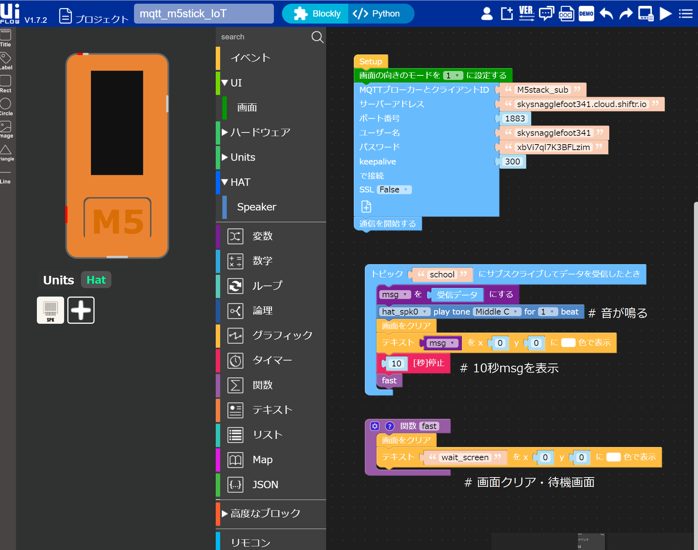

# Timer_Watch_IoT

## 目的
timer & MQTTを使ってシステムを構築する。
## 目標
timer & MQTTのプログラムはpythonで実現。


## 目次・流れ
1. システム概要
1. MQTT・MQTTブローガー
1. python プログラム

## 1.システム概要
### あばうとに
RaspberryPi側で時間を管理し時間になったらM5stickに通知する。
### 理由
M5stackにはタイマー機能があるためM5stack単体でのプログラムもできなくはないが、以下の理由で却下
- 入力ができない。(一度プログラムしたらそのまま)
- M5stackが対応できるセンサー・サービスの数がすくない。
- MQTTのプログラムの勉強がしたかった。
### 動作環境
|MQTT|説明|
| :-: | - |
| publish | pythonが実行できる機器 and paho-mqtt ライブラリがインストール済み |
| subscription | M5stick |

## 2.MQTTとは
別の時にまとめたものがあるのでそれを参照。
[MQTTまとめ](http://devcenter.magellanic-clouds.com/learning/mqtt-spec.html)


## 3.pythonプログラム

### 全体的なプログラムの紹介


#### timer.py
```python

#!usr/bin/python
# -*- coding: utf-8 -*- 
import time
import datetime
import test
import mqtt_M5stick_pub as pub_mqtt


def time_judge(msg):
    
    while True:
        # 時間取得・string変換
        now = datetime.datetime.now()
        now_time = str(now.time())
        time_s = now_time[:-10]     # 00:00の形式になる(秒はない)
        # print(time_s)             # 現在の時間を確認できる

        # 時間を判定
        if time_s == msg:
            pub_mqtt.main()
            break
        
        time.sleep(5)               # 5秒に1回判定、精度を高めるため。


def main():
    
    msg = input("時間 00:00 の形で入力 ＞ ")                   # 時間を入力
    
    time_judge(msg)
    
    print('終了しました')
 

if __name__ == "__main__":
    main()
```

#### mqtt_device_pub.py

```python
#!usr/bin/python
# -*- coding: utf-8 -*- 

import paho.mqtt.client as mqtt     # MQTTのライブラリをインポート
from time import sleep              # 3秒間のウェイトのために使う
import time

# ブローカーに接続できたときの処理
def on_connect(client, userdata, flag, rc):
  print("Connected with result code " + str(rc))

# ブローカーが切断したときの処理
def on_disconnect(client, userdata, flag, rc):
  if rc != 0:
     print("Unexpected disconnection.")

# publishが完了したときの処理
def on_publish(client, userdata, mid):
  print("publish: {0}".format(mid))

# メイン関数   この関数は末尾のif文から呼び出される
def main():
  flag = True
  client = mqtt.Client(client_id="pub_client")                 # クラスのインスタンス(実体)の作成 & 名前決め
  client.on_connect = on_connect         # 接続時のコールバック関数を登録
  client.on_disconnect = on_disconnect   # 切断時のコールバックを登録
  client.on_publish = on_publish         # メッセージ送信時のコールバック

  client.username_pw_set(username="skysnagglefoot341", password="xbVi7ql7K3BFLzim")     # ユーザー情報ない場合はコメントアウト
  client.connect("skysnagglefoot341.cloud.shiftr.io", 1883, 60)  # 接続先は自分自身

  # 通信処理スタート
  client.loop_start()    # subはloop_forever()だが，pubはloop_start()で起動だけさせる

  # 永久に繰り返す
  while True:                                          # ループにしないと通信からbreakしない
    if flag:
      client.publish("school", "Hello World")          # トピック名とメッセージを決めて送信
      print('送信しました')
      sleep(2)                                         # 時間をおかないとbreakしない
      break

if __name__ == '__main__':          # importされないときだけmain()を呼ぶ
  main()    # メイン関数を呼び出す

```
#### mqtt_M5stick_pub.M5F



