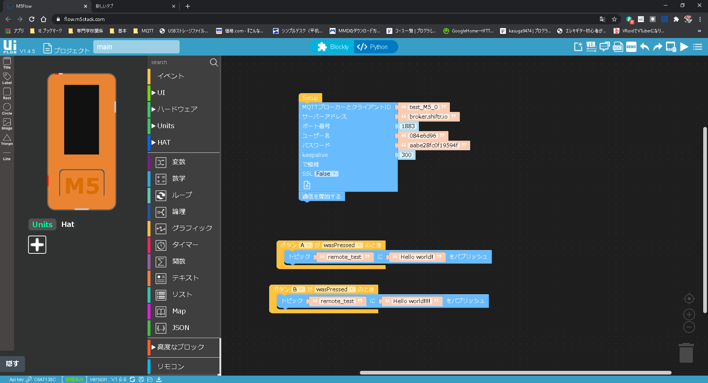

# EnvSensorのテスト 20201201
## 初めに
色々調べてやったけど間違って認識していう部分があると思われる。
___
>## 目的
>>M5stackからパソコン or raspberryPIに対してMQTTサーバーを用いてデータを送信する。
>## 目標
>>pythonで実現する。
---
## 機能
- M5stackのボタンを押すとテキストデータを別の機器に送る。
- MQTTサーバを使ってデータをアップロードする。(shiftr.io)
- pythonでプログラムを書き受け取る。
---
## 流れ
1. MQTTとは。
1. shiftr.ioとは、その設定。
1. pythonのプログラム
1. 実行結果
---
## 1. MQTTとは
### MQTTの仕様 (最低限の仕様)
>[参考サイト](http://devcenter.magellanic-clouds.com/learning/mqtt-spec.html)
- MQTTは通信が軽く、通信環境があまりよくない場所、機器にとっても利点が多くIoT機器などの通信に使用されている。
- **Publish/Subscribe** メッセージングモデルにより、１対多の通信ができるプロトコルです。
- メッセージを送信する側、受信する側両方を**Consumer**といいます。(client?)
- Publisher と Subscribe を繋ぐのが **MQTT Server** です。
- MQTT Serverがメッセージを仕分けするとき識別するものが、**Topic**と呼ばれるもの。
### MQTTの用語
#### 用語
1. Publish
1. Subscribe
1. Consumer(client)
1. MQTT Serve
1. Topic
#### 解説
1. Publish（パブリッシュ）といいデータを送信する側です。
1. Subscribe (サブスクラブ)といいデータを受信する側です。
1. Consumer（コンシューマー）といい上記の両方のことをさします。私はclient（クライアント）と思ったほうがイメージしやすかったです。
1. MQTT Serve（MQTTサーバー）PublistとSubscribeをつなげるサーバーのことです。今回は(shiftr.io)を使用しています。
1. Topic（トピック）MQTTサーバーがメッセージを仕分けするときに識別するキーのことです。
___
## 2. shiftr.ioとは、その設定。
### shiftr.ioとは
>[参考サイト](https://iot-gym.com/mqtt-brokers-and-libraries-suitable-for-obniz/)

最近人気のMQTTサービスです。ユーザ登録をしてIDとpassを作成してBrokerを行う仕組みなので、ID, PW接続になります。

視覚的に接続状況・通信状況をリアルタイムで確認できるのでデバックなどなどすごく便利。

### shiftr.ioの設定　
>~~[参考サイト](https://qiita.com/kmaepu/items/644b0bf2c3f438e71aa6)~~
1. アカウントを作成
1. New Namespaceをクリックし、iot-M5start-20201201という名前で空間を作成
1. 空間に接続するユーザー[M5stack_01][remote_dev]を作成。(パスワードは記述しない)

**2021/2/1 shiftr.io の大型アップデートにより仕様変更あり。しかし、大体同じ。**

___
## 3. プログラムの説明
>[参考サイト](https://qiita.com/hsgucci/items/6461d8555ea1245ef6c2)
>[参考サイト２](https://www.eclipse.org/paho/index.php?page=clients/python/docs/index.php#connect-reconnect-disconnect)

### python Subscriber 
ファイル名：sub_test.py
```python
import paho.mqtt.client as mqtt     # MQTTのライブラリをインポート

# ブローカーに接続できたときの処理
def on_connect(client, userdata, flag, rc):
  print("Connected with result code " + str(rc))  # 接続できた旨表示
  client.subscribe("remote_test")  # subするトピックを設定 

# ブローカーが切断したときの処理
def on_disconnect(client, userdata, flag, rc):
  if  rc != 0:
    print("Unexpected disconnection.")

# メッセージが届いたときの処理
def on_message(client, userdata, msg):
  # msg.topicにトピック名が，msg.payloadに届いたデータ本体が入っている
  print("Received message '" + str(msg.payload) + "' on topic '" + msg.topic + "' with QoS " + str(msg.qos))

# MQTTの接続設定
client = mqtt.Client(client_id="test_M5_1")                 # クラスのインスタンス(実体)の作成　# 引数は接続IDを指定できる
client.on_connect = on_connect         # 接続時のコールバック関数を登録
client.on_disconnect = on_disconnect   # 切断時のコールバックを登録
client.on_message = on_message         # メッセージ到着時のコールバック

client.username_pw_set(username="", password="") # shiftr.ioで作成したユーザとパスワードを記入
client.connect("broker.shiftr.io", 1883, 60)  # 接続先は自分自身

client.loop_forever()                  # 永久ループして待ち続ける

```

### python Subscriber 

ファイル名：pub_test.py
```python
#!usr/bin/env python
# -*- coding: utf-8 -*- 

import paho.mqtt.client as mqtt     # MQTTのライブラリをインポート
from time import sleep              # 3秒間のウェイトのために使う

# ブローカーに接続できたときの処理
def on_connect(client, userdata, flag, rc):
  print("Connected with result code " + str(rc))

# ブローカーが切断したときの処理
def on_disconnect(client, userdata, flag, rc):
  if rc != 0:
     print("Unexpected disconnection.")

# publishが完了したときの処理
def on_publish(client, userdata, mid):
  print("publish: {0}".format(mid))

# メイン関数   この関数は末尾のif文から呼び出される
def main():
  client = mqtt.Client(client_id="pub_client")    # ID決めれる
  client.on_connect = on_connect         # 接続時のコールバック関数を登録
  client.on_disconnect = on_disconnect   # 切断時のコールバックを登録
  client.on_publish = on_publish         # メッセージ送信時のコールバック

  #client.connect("localhost", 1883, 60)  # 接続先は自分自身
  
  
  #client.username_pw_set(username="1f158b0c", password="12112a583d0962db")  # アカウントがいる場合
  client.connect("10.17.211.120", 1883, 60)  # 接続IP


  # 通信処理スタート
  client.loop_start()    # subはloop_forever()だが，pubはloop_start()で起動だけさせる

  # 永久に繰り返す
  # 送信処理内容
  while True:
    client.publish("school/pi","Hello, Drone!")    # トピック名とメッセージを決めて送信
    sleep(3)   # 3秒待つ

if __name__ == '__main__':          # importされないときだけmain()を呼ぶ
  main()    # メイン関数を呼び出す

```

### M5flow
ファイル名：pub_test.m5f

___
## 4. 実行結果
### 動画
[実行動画](https://drive.google.com/file/d/1pYbPyLvVVk_5yDVLfEk2iTh1STdV19X2/view?usp=sharing)
